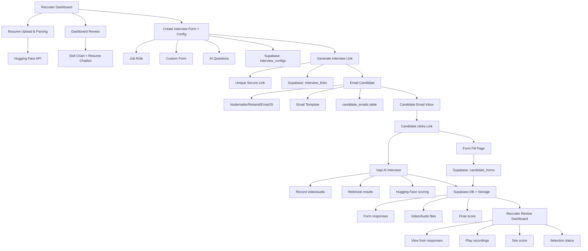

# HireEZ - AI-Powered Recruitment Platform


## Overview

HireEZ is an innovative AI-powered recruitment platform designed to streamline and enhance the hiring process. The platform leverages artificial intelligence to analyze resumes, conduct interviews, and provide comprehensive candidate insights.

## Application Flow



## Features

### 🔍 Resume Analysis
- AI-powered resume screening via Hugging Face API
- Skills extraction and matching
- Experience level assessment
- Education verification
- Automated candidate scoring

### 🤖 AI Interview System
- Automated interview scheduling
- Real-time interview analysis
- Behavioral assessment
- Technical skill evaluation
- Candidate response analysis
- Video/Audio recording and analysis

### 📊 Dashboard Analytics
- Real-time recruitment metrics
- Performance analytics
- Skill trend analysis
- Hiring statistics
- Usage analytics

### 🔐 Authentication System
- Secure login system
- Role-based access control
- Session management
- Mock authentication for development

## Tech Stack

- **Frontend**: Next.js 14, React, TypeScript
- **Styling**: Tailwind CSS, Shadcn UI
- **State Management**: React Context
- **Authentication**: Custom Auth Provider
- **Charts**: Chart.js
- **Notifications**: Sonner
- **AI Integration**: Hugging Face API, Vapi AI
- **Email Service**: Nodemailer/Resend/EmailJS
- **Database**: Supabase
- **Storage**: Supabase Storage

## Getting Started

### Prerequisites

- Node.js 18.x or higher
- npm or yarn
- Git
- Supabase account
- Hugging Face API key
- Vapi AI credentials

### Installation

1. Clone the repository:
```bash
git clone [repository-url]
cd project
```

2. Install dependencies:
```bash
npm install
```

3. Set up environment variables:
```bash
cp .env.example .env.local
```
Fill in the required API keys and credentials.

4. Start the development server:
```bash
npm run dev
```

5. Access the application:
```
http://localhost:3000
```

### Mock Credentials

For development and testing purposes, use the following credentials:
- Email: user@example.com
- Password: password123

## Project Structure

```
project/
├── app/
│   ├── dashboard/
│   ├── login/
│   ├── upload/
│   ├── interview/
│   └── layout.tsx
├── components/
│   ├── AuthProvider.tsx
│   ├── DashboardLayout.tsx
│   └── ui/
├── lib/
│   ├── supabase.ts
│   ├── huggingface.ts
│   └── vapi.ts
└── public/
```

## Development Status

The project is currently under active development with the following focus areas:

### In Progress
- 🔄 Interview process refinement
- 🔄 Enhanced AI analysis algorithms
- 🔄 Performance optimization
- 🔄 Additional analytics features
- 🔄 Email integration
- 🔄 Video/Audio processing
- 🔄 Webhook implementation

### Planned Features
- 📅 Advanced candidate matching
- 📅 Integration with job boards
- 📅 Custom interview templates
- 📅 Enhanced reporting system
- 📅 Bulk email processing
- 📅 Advanced analytics dashboard

## Documentation

For detailed documentation, visit our documentation website:
[Documentation](https://resume-iota-rose-60.vercel.app/)

> Note: The documentation is continuously being updated as new features are developed and refined.

## Contributing

We welcome contributions! Please read our contributing guidelines before submitting pull requests.

## License

This project is licensed under the MIT License - see the LICENSE file for details.

## Support

For support, please open an issue in the repository or contact the development team.

---

<div align="center">
  <p>Built with ❤️ by the HireEZ Team</p>
  <p>© 2024 HireEZ. All rights reserved.</p>
</div> 
